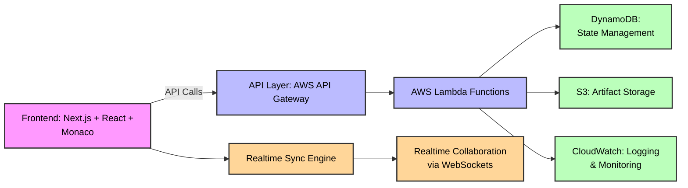

# RuntimePad

**RuntimePad** is a **multi-tool developer platform** designed to make everyday coding tasks easier, faster, and collaborative — all in one place. It consolidates essential developer tools in a single platform to improve productivity, experimentation, and learning.

## Tools & Features

* **[Code Editor](https://www.runtimepad.com/editor)** – Regular code editor with syntax highlighting, saving, multiple language support, and shareable links.
* **[Real-time Collaborative Code Editor](https://www.runtimepad.com/editor)** – Live code editor with real-time syncing, syntax highlighting, and all features of the regular code editor.
* **[JSON Beautifier](https://www.runtimepad.com/json-beautifier)** – Format, validate, and beautify JSON data with syntax highlighting and error detection.
* **[Diff Checker](https://www.runtimepad.com/diff-checker)** – Compare text and code files with advanced diff visualization and syntax highlighting.
* **[Base64 Encoder/Decoder](https://www.runtimepad.com/base64)** – Encode text to Base64 or decode Base64 back to readable text with real-time validation.
* **[Markdown Previewer](https://www.runtimepad.com/markdown-preview)** – Write markdown and see HTML preview in real-time with export options.
* **[Regex Tester](https://www.runtimepad.com/regex-tester)** – Test regular expressions against sample text with detailed match results and examples.
* **[UUID Generator](https://www.runtimepad.com/uuid-generator)** – Generate RFC 4122 compliant UUID v4 identifiers with bulk generation options.
* **[Timestamp Converter](https://www.runtimepad.com/timestamp-converter)** – Convert between UNIX timestamps and human-readable dates with multiple time units.
* **[Case Converter](https://www.runtimepad.com/case-converter)** – Transform text between camelCase, snake_case, kebab-case, and other formats.
* **[Color Picker](https://www.runtimepad.com/color-picker)** – Pick colors and convert between HEX, RGB, HSL, HSV, and CMYK formats.
* **[HTML Escape/Unescape](https://www.runtimepad.com/html-escape)** – Escape HTML entities for security or unescape them back to readable characters.

## Tech Stack

* **Frontend**: [Next.js](https://nextjs.org/), [React](https://react.dev/)
* **Styling**: [Tailwind CSS](https://tailwindcss.com/)
* **Editor**: [Monaco Editor](https://github.com/microsoft/monaco-editor)
* **AWS Prototyping**: Components were prototyped on **AWS Lambda**, **API Gateway**, **DynamoDB**, **S3**, and **CloudWatch** to explore scalable, serverless architectures and production-ready patterns.

## Architecture

This diagram shows **frontend interaction**, **AWS serverless prototyping**, and how all tools are integrated for real-time collaboration.

## Contributing

RuntimePad is **open-source** and welcomes contributions from the community. You can contribute by:

* Opening issues to report bugs, request new features, or suggest improvements.
* Submitting pull requests to improve code, add new tools, or enhance existing features.
* Suggesting improvements for usability, performance, or documentation.

### Contribution Guidelines

1. Fork the repository.
2. Create a new branch for your feature or fix.
3. Follow the existing **code style** and **project structure**.
4. Submit a **pull request** with a clear description of your changes.

We are actively planning to integrate **AI-powered developer tools** to further enhance productivity and learning. Your contributions and feedback are highly welcome.

## License

This project is licensed under the **MIT License**.
